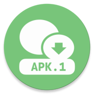

# WXAPK

在微信中直接安装接收到的 APK 文件

## 原理

微信为了提高恶意软件传播的成本，简单粗暴的在微信中传播的 APK 文件名后缀改为 .apk.1。
本 App 通过定义 apk.1 的 Intent Filter 来识别这种文件类型，分发给系统的应用安装器进行正常安装。

> [!CAUTION]
> 请自行确认收到的 APK 文件是可信任的，谨慎安装来源不明的 APK 文件

## 下载

或

[Releases](https://github.com/twiceyuan/WXAPK/releases)

## License 

MIT
